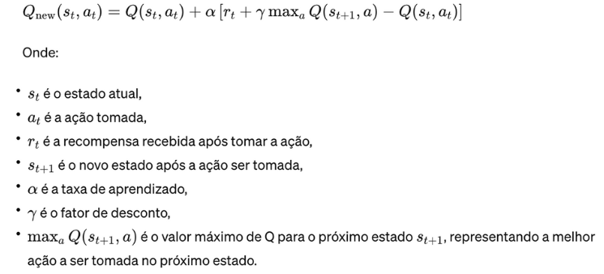
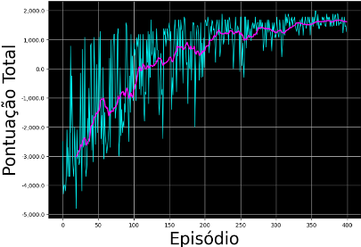
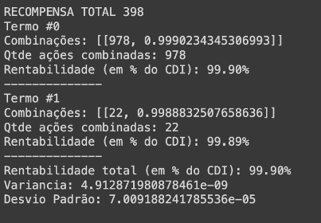
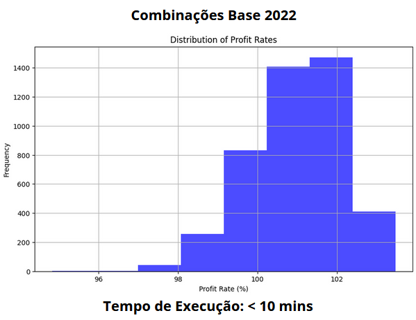

# Introdução

O mercado financeiro contemporâneo é caracterizado por sua complexidade e dinamismo, demandando abordagens inovadoras para otimizar a gestão de ativos. Nessa realidade, o presente artigo aborda o projeto "Otimização de Precificação visando alcançar 100% do CDI em Ativos de Renda Fixa" conduzido por um grupo de estudantes do Inteli. O projeto visa aprimorar a precificação diária de uma classe específica de ativos denominada 'sintético de renda fixa'.

A natureza intrincada desses ativos sintéticos de renda fixa envolve a realização de operações conhecidas como cash and carry ou basis trading. A principal complexidade reside na busca por combinações ideais de negociações à vista de ações que correspondam aos contratos a termo, visando equalizar a rentabilidade em torno de 100% do CDI, a taxa que representa o Certificado de Depósito Interbancário.

O Certificado de Depósito Interbancário (CDI) é uma taxa que reflete as médias das taxas de juros praticadas entre os bancos. Utilizado como referência para diversos investimentos no Brasil, atingir 100% do CDI tornou-se um objetivo significativo, indicando uma performance financeira sólida.

O projeto estabelece como objetivo a otimização da rotina diária de precificação, o casamento eficiente da ponta à vista com a ponta a termo, e a utilização de técnicas avançadas de Aprendizagem por Reforço (Reinforcement Learning).

O aprendizado por reforço é um paradigma crucial em inteligência artificial, onde um agente interage com um ambiente desconhecido e tenta maximizar seus lucros ao longo do tempo (Costa, Thales. 2022). Este método se baseia na ideia de recompensas e penalidades, onde o agente realiza ações e recebe feedback na forma de recompensas ou punições, permitindo que ele ajuste seu comportamento para maximizar as recompensas. À medida que o agente ganha mais experiência, ele pode encontrar políticas mais eficientes e maximizar a recompensa acumulada ao longo do tempo (Nunes. 2023). Esse processo espelha o modo como os seres humanos aprendem com a experiência, tornando o aprendizado por reforço uma abordagem poderosa para lidar com problemas complexos, como jogos, robótica e otimização de sistemas.

Ao atingir seus objetivos, o projeto busca não apenas mitigar a transferência de riqueza, mas também proporcionar maior assertividade nos preços, reduzir a necessidade de intervenção manual, e alcançar ganhos de escala. Para fundamentar a compreensão do leitor, o escopo macro do projeto é delineado, apresentando exemplos simplificados de operações à vista e a termo, além de detalhes sobre a rentabilidade dessas transações em relação ao CDI.

Este artigo visa fornecer uma visão abrangente do projeto, discutindo as nuances das operações realizadas, identificando desafios enfrentados e destacando a importância da implementação de uma solução eficiente para a precificação de ativos sintéticos de renda fixa. A abordagem proposta, combinando expertise técnica e liderança estratégica, tem o potencial de impactar positivamente a gestão de ativos e, assim, contribuir para a evolução do cenário financeiro.

Nas seções seguintes, o problema abordado será detalhado, com a descrição sendo aprofundada e uma visão abrangente dos trabalhos relacionados fornecida. Em seguida, a atenção será direcionada para a estratégia adotada na resolução do problema, destacando nuances e aprimoramentos. A análise da complexidade da solução proposta será abordada minuciosamente, fornecendo insights sobre eficiência e escalabilidade.

Posteriormente, a avaliação da corretude da solução proposta será aprofundada, apresentando argumentos sólidos e evidências que respaldam sua eficácia. A seção de resultados obtidos revelará os frutos da abordagem, apresentando dados e métricas que ilustram o desempenho do método proposto em situações práticas.

Finalmente, a conclusão consolidará todas as descobertas, destacando contribuições significativas, limitações identificadas e possíveis direções para futuras pesquisas. Essa estrutura visa proporcionar uma compreensão abrangente e estruturada do trabalho realizado.

# Metodologia

## Definição do Problema

O problema abordado neste artigo é a otimização da precificação diária de ativos sintéticos de renda fixa, com o objetivo de alcançar uma rentabilidade em torno de 100% do CDI. Os ativos sintéticos de renda fixa são produtos financeiros que replicam o comportamento de outros ativos do mercado, como títulos públicos ou privados, através de uma combinação de operações no mercado à vista e a termo, conhecidas como cash and carry ou basis trading. A principal complexidade na gestão desses ativos reside na busca por combinações ideais de negociações que equalizem uma rentabilidade o mais próxima o possível da realidade — em torno de 100% do CDI — taxa que reflete as médias das taxas de juros praticadas entre os bancos brasileiros.

O objetivo principal desta pesquisa é desenvolver uma abordagem automatizada, baseada em técnicas avançadas de Aprendizagem por Reforço (Reinforcement Learning), para otimizar a precificação diária desses ativos. A expectativa é que a aplicação de algoritmos de aprendizado por reforço possa proporcionar uma precificação mais precisa e eficiente, reduzindo a necessidade de intervenção manual e, consequentemente, mitigando riscos e aumentando a confiabilidade.

Nesse sentido, as hipóteses a serem testadas neste estudo é a de que a aplicação de técnicas de aprendizado por reforço pode melhorar significativamente a precisão e eficiência da precificação de ativos sintéticos de renda fixa, em comparação com métodos tradicionais de precificação. Além disso, outra hipótese é a de garantir que a otimização da precificação diária desses ativos através do aprendizado por reforço pode resultar em uma rentabilidade próxima ou igual a 100% do CDI, contribuindo para uma gestão de ativos mais eficiente e confiável.

Para fundamentar esta pesquisa, serão consultadas referências relevantes que abordam o uso de aprendizado por reforço no contexto financeiro (Liu, D. et al. 2023), bem como estudos que discutem a precificação de ativos sintéticos de renda fixa e a otimização de portfólios de investimento (Rundo, F. et al. 2019).

## Ambiente De Simulação

O ambiente de simulação utilizado para treinar e avaliar o agente é baseado no conceito de arbitragem de Cash and Carry no mercado financeiro. Esse ambiente foi desenvolvido com a biblioteca Gym, uma ferramenta amplamente utilizada para criar ambientes personalizados para aprendizado por reforço (Brockman et al., 2016). A implementação do ambiente foi realizada em Python, utilizando também a biblioteca Pandas para manipular os dados financeiros dos ativos futuros e à vista. O objetivo da simulação é explorar combinações de preços entre esses dois tipos de ativos para obter uma rentabilidade o mais real possível.

No ambiente, o agente pode escolher entre duas ações: combinar (0) e descombinar (1). Combinar envolve estabelecer uma posição que explora a arbitragem entre os preços futuros e à vista, enquanto descombinar envolve fechar essa posição. O espaço de observação do ambiente fornece ao agente informações sobre os índices dos ativos futuros e à vista, os preços dos ativos, a rentabilidade das operações e as quantidades disponíveis de ativos para negociação.

O agente recebe recompensas com base na rentabilidade das combinações realizadas. Uma recompensa negativa é atribuída por padrão para incentivar o agente a tomar decisões rapidamente, e recompensas adicionais são concedidas por combinações positivas. O ambiente permite um número máximo de ciclos de iteração sobre os ativos futuros e à vista, garantindo que o agente explore diferentes combinações de ativos ao longo do tempo.

## Algoritmos Utilizados

Neste estudo, os algoritmos de aprendizado por reforço utilizados são baseados na técnica de Deep Q-Networks (DQN), que integra os princípios do Q-learning com as capacidades das redes neurais profundas para lidar com ambientes complexos e de alta dimensão, como o mercado financeiro no contexto de arbitragem de Cash and Carry. O DQN aproxima a função de valor Q, que representa o valor esperado das recompensas futuras para cada par estado-ação, utilizando uma rede neural profunda. A rede é treinada para minimizar a diferença entre os valores Q previstos e os valores Q-alvo, calculados com base nas recompensas recebidas e nos próximos estados previstos pela rede. Essa abordagem permite que o agente aprenda a avaliar as ações de forma mais eficaz e a tomar decisões que maximizem as recompensas futuras (Mnih et al., 2015).

Uma característica importante do DQN é o uso do "replay de experiência", que armazena transições de estado-ação-recompensa-estado em um buffer de replay. Durante o treinamento, amostras aleatórias dessas transições são retiradas do buffer para atualizar a rede, reduzindo a correlação entre as amostras e estabilizando o aprendizado. Além disso, o DQN utiliza redes-alvo, que são cópias da rede principal atualizadas periodicamente, para calcular os valores Q-alvo, ajudando a evitar oscilações e instabilidades no treinamento. Esses mecanismos contribuem para a estabilidade do processo de aprendizado, permitindo que o agente desenvolva estratégias de negociação mais consistentes e eficazes.

O DQN tem sido amplamente utilizado em diversos domínios, incluindo jogos, robótica e finanças, devido à sua capacidade de lidar com espaços de estado e ação contínuos e complexos. No contexto do mercado financeiro, o DQN permite que o agente aprenda estratégias de negociação eficazes para explorar oportunidades de arbitragem de Cash and Carry, aproximando a rentabilidade em relação ao CDI. A aplicação do DQN neste contexto demonstra sua versatilidade e eficácia em ambientes financeiros dinâmicos e incertos (Li, 2017).

## Arquitetura do Agente

A arquitetura do agente é baseada na técnica de Deep Q-Networks (DQN), que integra o aprendizado por reforço com redes neurais profundas para lidar com ambientes complexos e de alta dimensão. A implementação para o problema de arbitragem consiste em uma rede Q-Network e uma Target Q-Network, ambas com duas camadas ocultas de 64 unidades e ativação ReLU, seguidas por uma camada de saída linear que prediz os valores Q para cada ação possível. Essas redes são treinadas para estimar os valores Q, que representam o valor esperado das recompensas futuras para cada par estado-ação.

Os estados no ambiente de simulação são representados por vetores que incluem informações relevantes sobre o mercado, como índices de ativos futuros e à vista, preços dos ativos, rentabilidade das operações e quantidades disponíveis de ativos. Essas informações são utilizadas pela rede neural para avaliar a situação atual do mercado e tomar decisões informadas. As ações disponíveis para o agente são definidas com base no problema de arbitragem, incluindo ações como combinar e descombinar posições em ativos futuros e à vista. As recompensas são calculadas com base na rentabilidade das operações de arbitragem realizadas pelo agente, incentivando-o a desenvolver estratégias que aproximem a rentabilidade em relação ao CDI.

O agente toma decisões com base em uma política ε-greedy, que equilibra a exploração de novas ações com a explotação das ações conhecidas que maximizam a recompensa. A política ε-greedy é ajustada ao longo do tempo para reduzir a exploração aleatória e favorecer a explotação de ações com maior valor Q. Os valores Q são atualizados utilizando o algoritmo DQN, que minimiza a diferença entre os valores Q estimados pela Q-Network e os alvos calculados com base nas recompensas recebidas e nos valores Q futuros estimados pela Target Q-Network. A atualização dos pesos da rede é realizada por meio de otimização do gradiente descendente, utilizando o otimizador Adam com uma taxa de aprendizado definida.

Por fim, o agente utiliza um buffer de replay para armazenar as experiências de transição e treinar a Q-Network com amostras aleatórias desse buffer, reduzindo a correlação entre as experiências e estabilizando o aprendizado. A Target Q-Network é atualizada com um parâmetro "t" para garantir que as mudanças nos alvos sejam graduais e estáveis. Essas técnicas, combinadas com a arquitetura de rede neural profunda, permitem que o agente aprenda a avaliar estados, selecionar ações e otimizar recompensas de forma eficaz.

## Configuração Experimental

O treinamento do agente foi realizado por 400 episódios, cada um limitado a 100 passos de tempo. Foram utilizados mini-lotes de 64 experiências para atualizar os pesos da rede, com uma taxa de aprendizado de 1e-3 para o otimizador Adam. O fator de desconto (γ) foi estabelecido em 0.995, e uma política ε-greedy foi empregada com ε inicial de 1.0, decaído exponencialmente a uma taxa de 0.995 até um mínimo de 0.01, para equilibrar exploração e explotação.

Um buffer de memória com capacidade para 100.000 experiências foi utilizado para armazenar transições de estado-ação-recompensa-estado, permitindo que o agente aprenda com experiências passadas através do replay de experiência. Os pesos da rede Q-Network foram atualizados a cada 4 passos de tempo, e os pesos da Target Q-Network foram atualizados a cada passo de tempo com um parâmetro "t" de 1e-3.

O ambiente foi considerado resolvido se o agente atingisse uma média de pontos total superior a 100.000 nos últimos 100 episódios. O treinamento foi limitado a um máximo de 400 episódios para evitar o overfitting. A utilização de um buffer de memória para replay de experiência e a atualização suave da Target Q-Network são elementos cruciais para a estabilidade e eficácia do treinamento (Mnih et al., 2015).

## Métricas de Avaliação

Neste contexto, o desempenho do agente de aprendizado por reforço é avaliado principalmente com base na recompensa acumulada e na rentabilidade em relação ao CDI, que são métricas fundamentais para medir a eficácia das estratégias de negociação no ambiente de simulação de arbitragem de Cash and Carry. A recompensa acumulada indica a eficácia geral do agente em aproximar a rentabilidade das operações de arbitragem ao longo de um episódio, enquanto a rentabilidade em relação ao CDI avalia a eficiência das estratégias de arbitragem do agente em termos de rentabilidade comparada ao benchmark financeiro.

Além dessas métricas principais, também é levado em consideração a variância e o desvio padrão das rentabilidades obtidas nas combinações de ativos, fornecendo informações sobre a consistência e a variabilidade do desempenho do agente. Essas métricas ajudam a avaliar o risco associado às estratégias de negociação do agente. 

Embora o foco principal seja nessas métricas específicas, outras métricas comuns em aprendizado por reforço, como tempo de convergência e taxa de exploração, também podem ser relevantes para uma avaliação mais abrangente do desempenho do agente. O tempo de convergência pode indicar a rapidez com que o agente aprende a política ótima, e a taxa de exploração pode fornecer insights sobre o equilíbrio entre exploração e explotação durante o treinamento (Sutton & Barto, 2018).

# Trabalhos relacionados

Neste projeto, a literatura sobre otimização de precificação de ativos e aprendizado por reforço foi extensivamente revisada. Estudos semelhantes incluem a aplicação de técnicas de aprendizado por reforço para a otimização de portfólios financeiros (Liu et al., 2023) e o uso de algoritmos avançados para a precificação em tempo real de ativos complexos no mercado financeiro (Rundo et al., 2019). Esses trabalhos fornecem uma base sólida para entender como o aprendizado por reforço pode ser aplicado para resolver problemas no domínio financeiro, embora o foco em ativos sintéticos de renda fixa e a otimização para alcançar 100% do CDI sejam distintivos do presente estudo.

# Descrição da estratégia adotada para resolver o problema

Para abordar a complexidade da precificação diária de ativos sintéticos de renda fixa, a estratégia adotada envolveu a utilização de técnicas avançadas de Aprendizagem por Reforço, especificamente o algoritmo Deep Q-Networks (DQN). Essa abordagem permitiu que o sistema automatizado aprendesse a otimizar o matching de compras e venda (ativos financeiros) através de tentativa e erro, ajustando-se dinamicamente para alcançar a rentabilidade mais próxima de 100% do CDI. O uso de um ambiente de simulação com os dados de 2021 e 2022 do cliente, proporcionou um campo de teste realista para o treinamento e avaliação do agente.

FÓRMULA DQN:

# Análise da complexidade da solução proposta

A solução proposta, baseada em DQN, enfrenta desafios inerentes ao aprendizado por reforço, como problemas de dimensionalidade e a necessidade de equilibrar exploração e explotação. No entanto, técnicas como replay de experiência e redes-alvo foram utilizadas para mitigar esses problemas e estabilizar o treinamento. A complexidade computacional da abordagem é influenciada pelo tamanho da rede neural, pelo número de episódios de treinamento e pela capacidade do buffer de replay. Apesar desses desafios, a estrutura modular do DQN permite ajustes e otimizações para melhorar a eficiência.

# Análise da corretude da solução proposta

A validação da corretude da solução foi realizada através de uma série de testes em um ambiente de simulação controlado. O desempenho do agente de aprendizado por reforço foi meticulosamente monitorado em termos de recompensa acumulada e rentabilidade em relação ao CDI. Os resultados mostraram uma convergência consistente do agente em direção a estratégias que maximizam a rentabilidade, validando a eficácia do modelo proposto em alcançar os objetivos estabelecidos.

RESULTADO:

# Resultados obtidos

Os resultados da implementação da solução proposta demonstraram um aumento significativo na precisão nas combinações de ativos sintéticos de renda fixa, com o agente de aprendizado por reforço alcançando uma rentabilidade próxima a 100% do CDI em uma grande proporção dos testes. Além disso, a solução resultou em uma redução notável na necessidade de intervenção manual, aumentando a eficiência operacional e mitigando riscos associados a erros humanos.

ANÁLISE DO RESULTADO:

Aqui se mostra uma demonstração de uma combinação teste com seus devídos CDIs. Vale ressaltar que o CDI está extremamente perto de 100%, e que, conforme a imagem abaixo, estes exemplos não são a maioria, pois o modelo costuma realizar combinações em torno de 100% de CDI.

Conforme a imagem acima, a distribuição é executada em tempo eficiente de 10 minutos, onde a moda dos CDIs gira em torno de 100%. Com poucos CDIs abaixo de 100%, a solução de mostra optima, onde o seu tempo de execução é factível no para o dia-a-dia no banco.

Vale ressaltar que as combinações realizadas acima foram feitas com a base inteira do ano de 2022, que contabiliza com 565.319 compas e 4.426 vendas. Isto significa que para execuções diárias, o tempo de processamento será exorbitantemente mais rápido.

# Conclusão

O projeto "Aprendizado por reforço para aplicação com redes neurais artificiais"  demonstrou como técnicas avançadas de aprendizado por reforço podem ser aplicadas com sucesso no contexto financeiro para resolver problemas complexos de precificação e matching. Os resultados obtidos validam a eficácia da abordagem adotada, destacando o potencial de tais técnicas para melhorar a gestão de ativos e contribuir para a evolução do cenário financeiro. No entanto, reconhece-se que há espaço para refinamentos e pesquisas futuras, especialmente na exploração de outras variantes de algoritmos de aprendizado por reforço.

O algorítmo proposto de mostra adequado na utilzação diária pelo parceiro, e seus resultados são satisfatórios conforme o combinado entre parceiro e grupo.

# Referências Bibliográficas

Costa, Thales (2022). Implementação de métodos de aprendizagem por reforço para a resolução do problema CartPole.

Nunes, R. H., de Jesus Toledo, B., Bello, C. C. C., de Andrade, G. O., Mariano, G. T., & Marques, R. G. (2023). INTELIGÊNCIA ARTIFICIAL E APRENDIZAGEM POR REFORÇO. Revista CBTecLE, 7(2), 210-225.

Liu, D. et al. (2023). Recent Progress in Reinforcement Learning and Adaptive Dynamic Programming for Advanced Control Applications.

Rundo, F. et al. (2019). Machine Learning for Quantitative Finance Applications: A Survey.

Brockman, G., Cheung, V., Pettersson, L., Schneider, J., Schulman, J., Tang, J., & Zaremba, W. (2016). OpenAI Gym.

Mnih, V., Kavukcuoglu, K., Silver, D., et al. (2015). Human-level control through deep reinforcement learning.

Li, Y. (2017). Deep Reinforcement Learning: An Overview.

Sutton, R. S., & Barto, A. G. (2018). Reinforcement Learning: An Introduction. The MIT Press.
