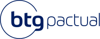

<table>
<tr>
<td>

</td>
<td>
</td>
</tr>
</table>

Aprendizado por reforço para aplicação com redes neurais artificiais

**Conteúdo**

- [1. Entendimento do Contexto do Problema](#1-entendimento-do-contexto-do-problema)
  - [1.1. Contexto da Indústria](#11-contexto-da-indústria)
    - [1.1.1. Sobre o BTG Pactual](#111-sobre-o-btg-pactual)
    - [1.1.2. Panorama da indústria](#112-panorama-da-indústria)
    - [1.1.3. Concorrência, Modelo de negócio e Tendências](#113-concorrência-modelo-de-negócio-e-tendências)
      - [1.1.3.1. Concorrência:](#1131-concorrência)
      - [1.1.3.2. Modelo de Negócio:](#1132-modelo-de-negócio)
      - [1.1.3.3. Tendências:](#1133-tendências)
    - [1.1.4. Análise das 5 Forças de Porter](#114-análise-das-5-forças-de-porter)
      - [1.1.4.1. Poder de Negociação dos Compradores:](#1141-poder-de-negociação-dos-compradores)
      - [1.1.4.2. Poder de Negociação dos Fornecedores:](#1142-poder-de-negociação-dos-fornecedores)
      - [1.1.4.3. Ameaça de Novos Entrantes:](#1143-ameaça-de-novos-entrantes)
      - [1.1.4.4. Ameaça de Produtos ou Serviços Substitutos:](#1144-ameaça-de-produtos-ou-serviços-substitutos)
      - [1.1.4.5. Rivalidade entre Concorrentes Existentes:](#1145-rivalidade-entre-concorrentes-existentes)
  - [1.2. Análise SWOT (FOFA)](#12-análise-swot-fofa)
    - [1.2.1. Forças](#121-forças)
    - [1.2.2. Oportunidades](#122-oportunidades)
    - [1.2.3. Fraquezas](#123-fraquezas)
    - [1.2.4. Ameaças](#124-ameaças)
  - [1.3. Descrição da Solução a ser Desenvolvida](#13-descrição-da-solução-a-ser-desenvolvida)
    - [1.3.1 Problema](#131-problema)
    - [1.3.2 Solução Proposta](#132-solução-proposta)
    - [1.3.3 Utilização da Solução](#133-utilização-da-solução)
    - [1.3.4 Benefícios](#134-benefícios)
  - [1.4. Canvas da Proposta de Valor do Produto](#14-canvas-da-proposta-de-valor-do-produto)
  - [1.5. Matriz de Riscos](#15-matriz-de-riscos)
    - [1.5.1. Ameaças](#151-ameaças)
    - [1.5.2. Oportunidades:](#152-oportunidades)
- [2. Relatório Técnico](#2-relatório-técnico)
  - [2.1. Análise de Dados Históricos](#21-análise-de-dados-históricos)
  - [2.2. Mapeamento do Ambiente e Elementos-Chave](#22-mapeamento-do-ambiente-e-elementos-chave)
    - [2.2.1. Mapeamento do ambiente e elementos chave:](#221-mapeamento-do-ambiente-e-elementos-chave)
    - [2.2.2. Elementos Chave do Ambiente:](#222-elementos-chave-do-ambiente)
    - [2.2.3. Ações do Agente:](#223-ações-do-agente)
    - [2.2.4. Recompensas:](#224-recompensas)
    - [2.2.5 Importância do Mapeamento:](#225-importância-do-mapeamento)
- [3. Entendimento do Negócio](#3-entendimento-do-negócio)
  - [3.1. Personas](#31-personas)
  - [3.2. User Stories](#32-user-stories)
  - [3.3. Jornada do Usuário](#33-jornada-do-usuário)

# 1. Entendimento do Contexto do Problema

## 1.1. Contexto da Indústria

### 1.1.1. Sobre o BTG Pactual

O Banking and Trading Group Pactual, conhecido como BTG Pactual, é o segundo maior banco privado do Brasil e o maior banco de investimento da América Latina. Sua trajetória de sucesso é atribuída à cultura de partnership meritocrático e empreendedor, que valoriza o talento e a iniciativa de seus colaboradores. Fundado em 1983, o banco possui sede no Rio de Janeiro e em São Paulo, além de escritórios em diversos países ao redor do mundo, focando em investimentos nos mercados emergentes. Apesar de ser altamente reconhecido pela sua atuação na área de Investment Banking, o BTG também possui operações nas seguintes áreas de negócios: Corporate Lending, Sales and Trading, Asset Management, Wealth Management e Participations.

### 1.1.2. Panorama da indústria

A indústria bancária brasileira passou por mudanças significativas nas últimas décadas, especialmente no que diz respeito à entrada de novos concorrentes e ao uso da tecnologia para oferecer serviços mais eficientes e acessíveis. Tradicionalmente, a indústria era dominada por cinco grandes bancos: Itaú, Banco do Brasil, Caixa Econômica Federal, Santander e Bradesco, que detinham a maior parte do mercado e tinham uma presença nacional consolidada. No entanto, nos últimos anos, novos players têm ganhado espaço no mercado, como o BTG Pactual, XP Investimentos e fintechs como o Nubank. Essas empresas têm aproveitado a tecnologia para oferecer serviços bancários mais ágeis, transparentes e personalizados, desafiando a burocracia e os altos custos associados aos bancos tradicionais.

As fintechs, em particular, têm sido disruptivas na indústria, oferecendo uma variedade de serviços, desde contas digitais até empréstimos e investimentos, com processos simplificados e taxas mais baixas. Essas empresas têm sido capazes de atrair uma base de clientes significativa, especialmente entre os jovens e os não bancarizados, que buscam alternativas mais acessíveis e convenientes aos serviços bancários tradicionais. Diante desse cenário, os grandes bancos têm sido pressionados a se adaptar e a inovar para permanecerem competitivos. Muitos têm investido em tecnologia e em novos modelos de negócio, como a oferta de serviços digitais e parcerias com fintechs, para melhor atender às demandas de seus clientes e enfrentar a concorrência cada vez mais acirrada no setor bancário brasileiro.

### 1.1.3. Concorrência, Modelo de negócio e Tendências

#### 1.1.3.1. Concorrência:

Além dos grandes bancos tradicionais, como Itaú, Bradesco e Banco do Brasil, o BTG Pactual enfrenta competição direta de outras instituições financeiras especializadas, como XP Investimentos e Credit Suisse. Esses players competem em diversas frentes, desde investment banking e gestão de ativos, buscando atrair clientes de alta renda e institucionais, até os serviços de assessoria financeira, levando a busca acirrada pelo maior número de escritórios de agentes autônomos de investimentos. A gestão eficiente das despesas e a capacidade de manter uma captação líquida significativa, como evidenciado pelo net new money de R$59 bilhões captados em 2023, posiciona o banco de maneira competitiva frente a esses desafios.

#### 1.1.3.2. Modelo de Negócio:

O modelo de negócio do BTG Pactual é centrado na oferta de serviços financeiros abrangentes, incluindo investment banking, gestão de ativos, wealth management e participações em empresas. O banco se destaca por sua expertise em mercados emergentes e pela capacidade de oferecer soluções personalizadas para seus clientes. Com uma abordagem baseada em taxas de serviço, o BTG Pactual busca maximizar retornos com menor alocação de capital, proporcionando uma base sólida para o crescimento sustentável. Um exemplo disso é a área de asset management, que teve uma captação líquida de R$28 bilhões em 2023, o maior nível do ano, destacando-se em produtos de renda fixa e alternativos. Já no segmento de wealth management, houve uma adição de R$31,3 bilhões, com uma contribuição significativa das iniciativas voltadas para o varejo de alta renda.

#### 1.1.3.3. Tendências:

O setor financeiro brasileiro está passando por uma rápida digitalização, impulsionada pela demanda dos clientes por conveniência e acesso instantâneo aos serviços. O BTG Pactual está capitalizando essa tendência com suas plataformas digitais voltadas para investimentos, conta corrente e conta empresarial, que têm experimentado um crescimento significativo. Além disso, a expansão internacional e a busca por oportunidades de investimento em mercados emergentes continuam sendo uma tendência importante para o banco, à medida que busca diversificar suas fontes de receita e expandir sua presença global. Um exemplo disso foi a compra do banco FIS Privatbank, de Luxemburgo, por 21 milhões de euros, com o intuito de expandir sua presença na Europa.

### 1.1.4. Análise das 5 Forças de Porter

#### 1.1.4.1. Poder de Negociação dos Compradores:

No segmento de alta renda e investimentos, os clientes possuem maior poder de negociação devido à sua capacidade financeira e ao acesso a diversas opções no mercado. No entanto, o BTG Pactual consegue manter uma posição forte devido à sua reputação e oferta diversificada de serviços. A instituição financeira busca entender as necessidades específicas de seus clientes e oferecer soluções personalizadas, criando um vínculo de confiança que reduz a pressão por preços mais baixos. No segmento de crédito, a estabilidade da inadimplência e o crescimento da carteira de crédito em 24% em 2023 demonstram a eficácia de sua gestão de riscos e relacionamento com clientes.

#### 1.1.4.2. Poder de Negociação dos Fornecedores:

Os principais fornecedores do BTG Pactual estão relacionados à tecnologia e infraestrutura, elementos essenciais para a operação do banco. Embora exista concorrência entre os fornecedores, o BTG Pactual possui um poder de negociação significativo devido ao volume de suas operações e à importância dos serviços fornecidos. Isso permite que o banco negocie condições favoráveis e garanta a qualidade e eficiência dos serviços prestados.

#### 1.1.4.3. Ameaça de Novos Entrantes:

A entrada de novos concorrentes no mercado de banking e investment banking é dificultada por diversos fatores, como os altos custos de entrada, os requisitos regulatórios e a necessidade de construir uma reputação sólida. O BTG Pactual, como um dos principais players do setor, possui uma posição consolidada que dificulta a entrada de novos concorrentes. Além disso, a instituição financeira possui uma base sólida de clientes e uma ampla gama de serviços, o que torna difícil para novos entrantes competir em igualdade de condições.

#### 1.1.4.4. Ameaça de Produtos ou Serviços Substitutos:

Com o avanço da tecnologia, surgem constantemente novos produtos e serviços financeiros que podem substituir ou complementar os oferecidos pelo BTG Pactual. Fintechs e plataformas de investimento online, por exemplo, oferecem alternativas mais acessíveis e convenientes para os clientes. Para lidar com essa ameaça, o BTG Pactual precisa continuar inovando e oferecendo serviços diferenciados, além de investir em tecnologia para melhorar sua oferta de produtos e serviços.

#### 1.1.4.5. Rivalidade entre Concorrentes Existentes:

A concorrência no setor de banking e investment banking é alta, com diversos players competindo por participação de mercado. Além dos grandes bancos tradicionais, o BTG Pactual enfrenta competição de outras instituições financeiras especializadas e fintechs. No entanto, o banco consegue se destacar devido à sua reputação, expertise e ampla gama de serviços. A instituição financeira busca constantemente inovar e melhorar seus serviços para manter sua posição competitiva no mercado. Como resultado disso, a área de investment banking fechou 2023 com R$1,6 bilhão em receitas. No quarto trimestre de 2023, as atividades de mercado melhoraram e a receita foi de R$464 milhões.

## 1.2. Análise SWOT (FOFA)

### 1.2.1. Forças

1. Maior Teste de Combinações Compras/Vendas: A rede neural possibilita mais testes de combinações possíveis em comparação com o sistema atual, que requer decisões humanas.
   
2. Execução Simples: É necessário apenas um CSV de entrada, e o output é também um único CSV, diminuindo a complexidade de inputs/outputs.
   
3. A Metodologia da Solução Não Precisa ser Reinventada: Redes Neurais com Aprendizado por Reforço é uma metodologia de Inteligência Artifical (IA) já estudado e testado, o que diminui incertezas da eficiencia, eficácia, implementação e utilidade do sistema.
   
4. Treinamento em Nuvem: O treinamento dos dados pode ser realizado em nuvem com os recursos disponíveis pela empresa, sem a necessidade de compra de hardware adicional para processamento.

### 1.2.2. Oportunidades

1. Facilita o Envio das Compras/Vendas Para Outros Sistemas/Equipes: Um dos objetivos principais do sistema a ser criado é que ao enviar as compras/vendas para outros sistemas/equipes, os dados já estarão organizados, eliminando tal trabalho que seria executado pelos recipientes.
   
2. Maior Redução de Possíveis Transferências de Riquezas: Com a solução combinando compras/vendas que resultem em CDIs balanceados (como, por exemplo, 100% em dias comuns), a Transferencia de Riquezas - problema que ocorre quando, na formação da renda fixa sintética, um credor fatura mais do que outro - é evitada.

### 1.2.3. Fraquezas

1. Sistema Complexo que Precisa Ser Bem Treinado: A rede neural precisa de bastante tempo, dedicação e boa seleção de dados de teste para alcançar resultados nos testes e exemplos práticos que sejam positivos e não enviesados.
   
2. Não é Factível Testar Todas as Combinações Possíveis: O custo computacional é extremamente alto, se tornando infactível para qualquer máquina da atualidade processar todas as combinações. Para lidar com este problema, métodos de treinamentos precisam ser aplicados para mitigar esta limitação, como treino em agrupamentos, por exemplo.
   
3. O Treinamento Requer Alto Custo Computacional: Mesmo que nem todas as possibilidades sejam treinadas, ainda sim o custo computacional é alto, o que requer bastante tempo de execução e espaço em nuvem, gerando gastos e tempo de espera.

### 1.2.4. Ameaças

1. Sistema Pode Ser Enviesado a Dados de Teste: Caso o treino seja mal executado, o sistema não aprenderá de fato como lidar com problemas reais a não ser o que foram alimentados no teste, pois ao invés de aprender e entender como resolver problemas, ele memoriza respostas e torna-se enviesado negativamente.
   
2. Tempo de Processamento Pode Ser Maior do que o Atual: Mesmo que a metodologia atual (manual) seja ineficiente comparada a uma IA com Rede Neural, o tempo de execução do sistema pode superar o que é considerado aceitável em execuções diárias, tornando a solução obsoleta na prática.

## 1.3. Descrição da Solução a ser Desenvolvida

### 1.3.1 Problema

O Banco BTG, maior banco de investimentos da América Latina, possui diversos produtos financeiros oferecidos tanto para clientes Business to Business (B2B) como Business to Customers (B2C). Um destes produtos, conhecido por ampliar opções financeiras para Pessoas Físicas, seria a classe de ativo denominada Renda Fixa Sintética, que consiste na combinação entre uma posição vendida em termo de ação com uma posição invertida. Ao longo do dia, o banco realiza compras e vendas desses ativos, e quando eles são repassados para o time de Analising, não existe um sistema de indexização/indentificação entre eles. A solução atual utilizada pelo parceiro consiste nos analistas do time em realizar manualmente as combinações com base em critérios pré-estabelecidos, como agrupar compras/vendas de acordo a uma taxa de CDI ideal para determinado dia, sendo 100% a mais comum. Esta solução, mesmo válida, possui espaço para aperfeiçoamento, pois o trabalho realizado por um Inteligência Artifical (IA) pode ocasiar em maior precisão em combinações com base em métricas de acertividade estabelecidas pelo parceiro e time de desenvolvimento.

### 1.3.2 Solução Proposta

O sistema proposto consiste em uma Rede Neural treinada com Aprendizado por Reforço que busca combinações ótimas de compras/vendas que cumpre métricas de eficácia, como tempo de processamento e acurácia de combinações satisfatórias. A solução à ser desenvolvida não consiste na construção de uma tecnologia nova, pois seu comportamento, eficácia e funcionalidade já foram estudados e testados, e são conhecidos pelo mercado. Isso garante que, caso bem planejada e treinada, o sistema apresentará resultados satisfatórios de operação

### 1.3.3 Utilização da Solução

O sistema é divido em duas etapas: treinamento e aplicação.

A etapa de treinamento consiste em treinamento da IA por uma carteira de compras e vendas anonamizadas fornecidos pelo parceiro de projeto. Esta etapa é de extrema importância e requer tempo de processamento em nuvem e amplificação de hiperparâmetros, se necessário. Isto requer custos operacionais em conjunto com tempo de operação em nuvem.

A etapa de aplicação é executada após o término da fase de treinamento, e nesta etapa, o cliente final consome e usufrui do produto final desenvolvido. O usúario, ao utilizar a aplicação, necessita somente o input de um arquivo CSV com as compras/vendas que deseja realizar as combinações, e após um determinado tempo de execução, o programa entrega um único arquivo CSV com as devidas combinações ótimas encontradas e suas taxas de CDI. 

### 1.3.4 Benefícios

A correta utilização da Rede Neural, após implementada, inclui: neutralização de possibilidades de Transferência de Riquezas, agrupamentos de compras/vendas com CDI próximo ou igual ao do alvo estabelecido e tomada de decisões com base em critérios estabelecidos pelo parceiro de projeto e time de desenvolvedores, como tempo de execução considerado ótimo para trabalhos cotidianos.

## 1.4. Canvas da Proposta de Valor do Produto

## 1.5. Matriz de Riscos

### 1.5.1. Ameaças

1. Complexidade do Modelo:
A implementação de técnicas avançadas de Aprendizagem por Reforço pode enfrentar desafios, como a complexidade do modelo, a necessidade de grandes conjuntos de dados e possíveis dificuldades na interpretação dos resultados.

2. Volatilidade do Mercado:
A volatilidade no mercado de renda fixa pode impactar a eficácia do modelo, especialmente se houver mudanças rápidas nas condições econômicas.

3. Necessidade de Atualização Contínua:
O projeto pode enfrentar a necessidade de atualizações regulares para manter a eficácia, dado que as condições do mercado e os padrões de negociação podem evoluir ao longo do tempo.

4. Desafios na Equalização da Rentabilidade:
Encontrar a combinação ideal para equalizar a rentabilidade em torno de 100% do CDI pode ser um desafio, e o projeto pode enfrentar dificuldades em situações em que não seja possível atender a esse objetivo.

5. Sensibilidade a Dados:
A sensibilidade dos modelos de aprendizado de máquina aos dados de entrada pode resultar em resultados imprecisos se os dados fornecidos não forem representativos ou estiverem sujeitos a anomalias.

6. Riscos de Conformidade:
O projeto pode estar sujeito a riscos de conformidade, especialmente ao lidar com dados financeiros sensíveis e informações do mercado. É essencial garantir que todas as regulamentações sejam seguidas estritamente.

### 1.5.2. Oportunidades:

1. Otimização de Precificação:
Implementar técnicas de Aprendizagem por Reforço (Reinforcement Learning) pode resultar em uma otimização eficiente da rotina diária de precificação, melhorando a precisão e rapidez do processo.

2. Mitigação de Transferência de Riqueza:
Ao alcançar a rentabilidade em torno de 100% do CDI, o projeto pode contribuir significativamente para a mitigação de transferência de riqueza, aumentando a confiança dos investidores.

3. Automatização e Ganho de Escala:
A implementação bem-sucedida do projeto pode resultar em maior automatização do processo de precificação, levando a ganhos de escala, redução de custos e menor necessidade de intervenção manual.

4. Parceiro dar continuidade ao MVP:
A continuidade do MVP oferece a nós uma rica experiência prática, oportunidades de networking no setor financeiro, reconhecimento acadêmico e a possibilidade de coautoria. Além disso, essa continuidade pode abrir portas para futuras oportunidades de emprego e estágio.

# 2. Relatório Técnico

## 2.1. Análise de Dados Históricos

Esta seção apresenta uma análise histórica (Qualitativa) dos estudos realizados sobre a aplicação de aprendizado por reforço profundo (DRL) em problemas de finanças, e relaciona-os com o projeto de otimização de precificação de ativos de renda fixa sintética usando aprendizado por reforço (RL). Relembramos que o projeto consiste em encontrar o conjunto de combinações ideais que equalize, quando possível, a rentabilidade dos ativos sintéticos em torno de 100% do CDI, ou que siga uma estrutura de termo de rentabilidade não-decrescente.

Foram revisados seis artigossobre a aplicação de DRL em problemas de finanças, que envolvem decisões sequenciais sob incerteza, que podem ser modelados como processos de decisão de Markov (MDPs) ou processos de decisão de Markov com restrições (CMDPs). Os artigos mostram diferentes aplicações do DRL em finanças, usando diferentes arquiteturas, algoritmos, e dados. Os artigos são:

- **Empirical Study on Stock Index Futures Arbitrage and Relationship with Spot Index Based on CSI300 Stock Index Futures:** usa o DRL para explorar oportunidades de arbitragem entre o índice de ações CSI 300 e seus contratos futuros na China.

- **MDRL-IR: Incentive Routing for Blockchain Scalability With Memory-Based Deep Reinforcement Learning:** usa o DRL para resolver o problema de roteamento em redes de canais de pagamento (PCNs), que são uma solução para a escalabilidade do blockchain.

- **Deep reinforcement learning with credit assignment for combinatorial optimization:** usa o DRL para resolver problemas de otimização combinatória (CO), que são problemas de decisão que envolvem a escolha de um subconjunto ótimo de elementos de um conjunto finito.

- **Application of deep reinforcement learning in asset liability management:** usa o DRL para resolver o problema de gestão de ativos e passivos (ALM), que é uma técnica de gerenciamento de risco em finanças quantitativas.

- **Reinforcement learning for pricing strategy optimization in the insurance industry:** usa o DRL para resolver o problema de ajuste de preços de renovação no setor de seguros, que é um problema que envolve dois objetivos conflitantes: reter os clientes existentes e aumentar a receita.

- **GraphSAGE with deep reinforcement learning for financial portfolio optimization:** usa o DRL para resolver o problema de otimização de portfólio, que é um problema que visa maximizar os retornos e controlar o risco dentro de limites razoáveis.

A relação entre os artigos e o projeto é que todos eles usam o DRL para resolver problemas de finanças que envolvem decisões sequenciais sob incerteza, que podem ser modelados como MDPs ou CMDPs. O projeto usará o RL para resolver o problema de otimização de precificação de ativos de renda fixa sintética, que é um problema que visa equalizar a rentabilidade dos ativos sintéticos em torno de 100% do CDI, ou seguir uma estrutura de termo de rentabilidade não-decrescente. Algumas semelhanças e diferenças entre os artigos e o projeto são:

- Semelhanças:
    * Todos eles usam o DRL como uma técnica de inteligência artificial para resolver problemas de finanças que envolvem decisões sequenciais sob incerteza.

    * Todos eles usam o PPO como um algoritmo de DRL robusto e eficiente para aprender a política ótima.

    * Todos eles usam dados históricos de preços de ativos financeiros como entrada para o DRL.

- Diferenças:
    * Eles usam diferentes arquiteturas de redes neurais para aproximar a função de valor ou a política, como DNN, RNN, CNN, ou GraphSAGE, dependendo da natureza e da complexidade dos dados e dos problemas.

    * Eles usam diferentes modelos de MDPs ou CMDPs para representar os problemas, com diferentes espaços de ações e estados, diferentes funções de recompensa ou punição, e diferentes restrições ou regulamentações.

    * Eles usam diferentes domínios de aplicação, como futuros de índices de ações, roteamento de incentivo para blockchain, otimização de portfólio, gestão de ativos e passivos, otimização de estratégia de precificação no setor de seguros, e otimização de precificação de ativos de renda fixa sintética, com diferentes características e desafios.

Como tópico extra, foram analisados alguns pontos sobre o que influencia o CDI, que é uma taxa que reflete o custo médio dos empréstimos entre os bancos, e que acompanha a taxa Selic, que é definida pelo Banco Central. Os investimentos atrelados ao CDI são aqueles que usam o CDI como referência para calcular a rentabilidade, como alguns fundos de renda fixa, CDBs, LCIs, LCAs, entre outros. Os aspectos que podem influenciar nos resultados dos investimentos atrelados ao CDI são:

- A taxa Selic: como o CDI acompanha a taxa Selic, que é definida pelo Banco Central a cada 45 dias, qualquer alteração na Selic afeta diretamente o CDI e, consequentemente, os investimentos que usam o CDI como referência.

- O prazo do investimento: como o CDI é uma taxa diária, o prazo do investimento influencia no resultado final. Quanto mais tempo o investimento ficar aplicado, maior será o efeito dos juros compostos sobre o CDI.

- O imposto de renda: como a maioria dos investimentos atrelados ao CDI são tributados pelo imposto de renda, o valor líquido do investimento depende da alíquota do imposto, que varia de acordo com o prazo do investimento. Quanto menor o prazo, maior a alíquota, e menor o valor líquido.

- A taxa de administração: alguns investimentos atrelados ao CDI, como fundos de renda fixa, cobram uma taxa de administração para gerir o portfólio. Essa taxa reduz a rentabilidade do investimento, e pode variar de acordo com o tipo e o tamanho do fundo. Quanto maior a taxa, menor a rentabilidade.

Os fatores que têm impacto direto no CDI são:

- A política monetária do Banco Central: como o CDI acompanha a taxa Selic, que é definida pelo Banco Central a cada 45 dias, a política monetária do Banco Central afeta diretamente o CDI, pois depende da meta da taxa Selic, que é estabelecida pelo Comitê de Política Monetária (Copom) para controlar a inflação e o crescimento econômico.

- A inflação: a inflação é o aumento generalizado dos preços dos bens e serviços, que reduz o poder de compra da moeda. A inflação afeta o CDI, pois influencia na definição da meta da taxa Selic pelo Copom, que busca manter a inflação dentro da meta estabelecida pelo Conselho Monetário Nacional (CMN).

- A demanda por crédito: a demanda por crédito é a procura por recursos financeiros por parte dos agentes econômicos, como consumidores, empresas e governo, para financiar seus gastos, investimentos ou dívidas. A demanda por crédito afeta o CDI, pois influencia na oferta e no custo dos empréstimos entre os bancos, que determinam o CDI.

*OBS: A análise quantitativa dos dados será detalhada nas próximas sprints, pois não temos ainda acesso ao dataset.*

## 2.2. Mapeamento do Ambiente e Elementos-Chave

### 2.2.1. Mapeamento do ambiente e elementos chave:

Neste projeto, o ambiente operacional é o mercado financeiro, com foco em ativos de renda fixa sintética. O objetivo principal é otimizar a combinação desses ativos para alcançar uma rentabilidade em torno de 100% do CDI. Para isso, é necessário um mapeamento detalhado dos elementos essenciais desse ambiente, incluindo as ações possíveis do agente e as recompensas associadas.

### 2.2.2. Elementos Chave do Ambiente:

Ativos à Vista e à Termo: O agente interage com um conjunto de ativos à vista e contratos a termo. Estes ativos são a base para a formação dos ativos sintéticos de renda fixa.
Combinações de Ativos: O agente precisa identificar combinações viáveis de ativos à vista que correspondam aos contratos a termo, formando assim os ativos sintéticos desejados.
Dinâmica de Mercado: As variações de preço, volume e data de vencimento dos ativos influenciam diretamente as decisões e a performance do agente.

### 2.2.3. Ações do Agente:

Seleção de Ativos: O agente deve escolher conjuntos de ativos à vista que correspondam aos contratos a termo.
Avaliação de Combinações: Após a seleção, o agente avalia as combinações para determinar a rentabilidade potencial em relação ao CDI.
Otimização de Seleção: Ao invés de buscar maximizar a rentabilidade, o agente foca em alinhar a rentabilidade dos ativos sintéticos com o objetivo de aproximar-se o máximo possível de 100% do CDI. Essa abordagem considera que, em alguns casos, uma rentabilidade levemente abaixo de 100% do CDI pode ser mais desejável do que uma rentabilidade significativamente maior. Por exemplo, uma combinação que resulte em 99% do CDI pode ser preferível a uma que alcance 124% do CDI. O agente, portanto, ajusta suas escolhas com base nesse critério, buscando um equilíbrio entre alcançar a meta de rentabilidade e evitar discrepâncias excessivas que possam indicar um risco ou ineficiência na seleção dos ativos.

### 2.2.4. Recompensas:

As recompensas são ajustadas para refletir a meta de alinhar a rentabilidade dos ativos sintéticos o mais próximo possível de 100% do CDI, ao invés de simplesmente maximizá-la. Isso significa que o agente será incentivado a tomar decisões que resultem em uma rentabilidade que não apenas atinja, mas idealmente se mantenha próxima de 100% do CDI. Em casos onde a rentabilidade é significativamente maior, como 124% do CDI, o sistema preferirá uma rentabilidade ligeiramente abaixo de 100% do CDI, como 99%, para evitar discrepâncias excessivas. Essa estrutura de recompensas é crucial para assegurar que as decisões do agente estejam alinhadas com o objetivo de manter a estabilidade e previsibilidade na precificação dos ativos.

### 2.2.5 Importância do Mapeamento:

Esse mapeamento é fundamental para a modelagem adequada do problema. Ele fornece insights sobre como diferentes ações afetam o ambiente e como as recompensas podem ser alinhadas com os objetivos do projeto. Compreender esses elementos é crucial para definir regras e estratégias eficazes para o agente, permitindo que ele opere com sucesso no ambiente complexo do mercado financeiro.

# 3. Entendimento do Negócio

## 3.1. Personas

A Persona é uma ferramenta central no design centrado no usuário, servindo como uma representação fictícia de um segmento do usuário final. Ao criar uma persona, você humaniza seus dados de pesquisa, oferecendo um rosto, nome e background para seu público-alvo, facilitando assim a tomada de decisões centradas no usuário. A Persona deve ser baseada em dados reais e pesquisas com usuários para garantir sua eficácia.

Essa representação descreve as características demográficas, comportamentais, sociais desse grupo específico clientes. Ela permite que as empresas tenham uma visão mais clara e detalhada das necessidades, desejos, preocupações e contextos dos clientes-alvo, o que é fundamental para a criação de produtos, serviços e soluções que sejam mais atraentes e eficazes, especificamente para esse grupo.

## 3.2. User Stories

## 3.3. Jornada do Usuário

